# Penny — a conversational PFM agent

> Zafin AI Coding Assignment · Conversational Personal Finance Management agent
> for a US retail bank.

Penny is a chat-based spending companion. She answers natural-language questions
about six months of transaction history by calling analytics tools — she never
does the arithmetic herself, and she never sees the full transaction file.

**Demo video:** _(≤ 3 min — add your Loom / Drive link here)_

---

## 📊 Start here — the Build Report

**[`docs/build-report.html`](docs/build-report.html)** is the complete write-up
of this build, and the best single place to start: executive summary, the full
user-story coverage table, tech stack, backend components, system architecture,
the end-to-end flow, design principles, and the plan for integrating this into a
real mobile banking app with production hardening.

It is one self-contained file — both architecture diagrams are embedded, so it
renders anywhere with no assets alongside it:

```bash
git clone https://github.com/iMuks/Zafin-pfm-agent.git
open Zafin-pfm-agent/docs/build-report.html      # macOS
# xdg-open on Linux, start on Windows
```

> GitHub cannot render HTML in the browser from a repository view — clone and
> open it locally, or download the raw file. Everything below is the practical
> README: what to install, how to run it, and how the system is put together.

---

## Run it — step by step

**Prerequisites:** Python 3.12 or newer, and an Anthropic API key
([console.anthropic.com](https://console.anthropic.com)).

### 1 · Get the code

```bash
git clone https://github.com/iMuks/Zafin-pfm-agent.git
cd Zafin-pfm-agent
```

### 2 · Create a virtual environment and install

```bash
python3 -m venv .venv
source .venv/bin/activate         # Windows: .venv\Scripts\activate
pip install -r requirements.txt
```

### 3 · Add your API key

```bash
cp .env.example .env
```

Open `.env` and set the key:

```
ANTHROPIC_API_KEY=sk-ant-...
```

`.env` is gitignored; `.env.example` only ever holds a placeholder. Nothing else
needs configuring — every other setting has a working default.

### 3b · Or run with a local model, no API key

Every model call can stay on your own machine. Install [Ollama](https://ollama.com), pull an open-weights model, and point Penny at it:

```bash
ollama pull qwen3:4b                 # ~2.5 GB; qwen3:8b is better if you have the memory
ollama serve                         # OpenAI-compatible endpoint on http://127.0.0.1:11434/v1
```

Then in `.env`, select the local registry keys and leave `ANTHROPIC_API_KEY` unset:

```bash
PENNY_MODEL_KEY=local-qwen3-4b
PENNY_GREETING_MODEL_KEY=local-qwen3-4b
PENNY_JUDGE_MODEL_KEY=local-qwen3-4b
PENNY_ANALYST_MODEL_KEY=local-qwen3-4b
```

The local provider refuses any endpoint that is not a loopback or private-network host, and any Ollama `:cloud` model tag, so a misconfiguration fails at startup instead of sending data out. `GET /api/health` reports `provider` and `endpoint`. In production the same keys point at a vLLM service inside the VPC via `PENNY_LOCAL_BASE_URL`.

### 4 · Start the app

```bash
uvicorn penny.presentation.http.app:app --port 8000
```

If port 8000 is already taken, use `--port 8020` and substitute that port
everywhere below.

### 5 · Open it

<http://127.0.0.1:8000>

Penny opens the conversation herself with a live summary of the last complete
month — if you see that, the model call, the tool call and the stream all work.

### 6 · Confirm it is healthy

```bash
curl -s http://127.0.0.1:8000/api/health
```

Returns `status: ok`, the resolved model id, the ten tool names, and the dataset
coverage the agent is working from.

Interactive API docs, generated from the route response models:
<http://127.0.0.1:8000/docs>

> **You do not need to run the Task 2 enrichment.**
> `data/transactions_enriched.json` and `data/merchant_catalog.json` are both
> committed, so the app has its data the moment you clone. A plain
> `python scripts/enrich_transactions.py` is safe and free — it reuses the
> cached catalog and reproduces the same file. Never pass `--refresh` on this
> checkout: that re-asks the model for every descriptor, categorisation is not
> stable across runs, and the figures in the demo video and
> `docs/demo-transcript.md` would stop matching the app.

### 7 · Verify it, without spending anything

```bash
python -m unittest discover tests        # 162 tests — no API key, no network
python scripts/preview_components.py     # component gallery on :8001, no model calls
```

### 8 · Verify it against the running app

With the server from step 4 still up:

```bash
python scripts/validate_requirements.py --port 8000
```

Checks every line of the brief against the live app and writes
`docs/requirements-validation.md`. Exits non-zero if anything regressed.
Unlike step 7, this makes four live model calls, so it costs a few cents.

### 9 · Optional — the eval suite and the report

```bash
python -m eval.run_eval --limit 4        # smoke run, 4 cases
python -m eval.run_eval                  # full 14 cases — spends real money
python scripts/build_report.py           # rebuild docs/build-report.html
```

| Command | What it does |
| --- | --- |
| `python scripts/enrich_transactions.py` | Task 2 pipeline. Async, 4 batches in flight. |
| `uvicorn penny.presentation.http.app:app --reload` | The app. Penny opens with a live summary. |
| `python scripts/preview_components.py` | Component gallery on :8001. **No API key, no model calls** — use it for UI work and screenshots. |
| `python -m unittest discover tests` | 162 tests. No key, no network. |
| `python -m eval.run_eval` | Layer 9 eval. **Spends money** — see below. |
| `ruff check penny eval scripts tests` | Lint (CI enforces this). |

Commit `data/transactions_enriched.json` after the first run so reviewers can
skip enrichment.

> **Re-resolving the catalog changes the figures.** A plain re-run is
> deterministic — it reuses the cached `data/merchant_catalog.json`. But
> `--refresh` asks the model again, and categorisation is not stable across
> runs: one refresh moved a Canadian Tire charge into Shopping and changed a
> headline monthly total. Commit both `merchant_catalog.json` and
> `transactions_enriched.json`, and do not `--refresh` after recording the demo.

---

## API documentation

The app serves its own interactive docs once running:

| | |
| --- | --- |
| Swagger UI | `http://127.0.0.1:8000/docs` |
| ReDoc | `http://127.0.0.1:8000/redoc` |
| OpenAPI 3.1 | `http://127.0.0.1:8000/openapi.json`, committed as `docs/openapi.json` |

For anything consuming the API from outside this repo, read
**[`docs/API.md`](docs/API.md)** — the streaming contract, every component's
fields, session handling, error semantics, and client examples in curl, Python,
TypeScript and Swift. The one rule worth stating twice: the agent endpoints
return newline-delimited JSON, so read the body line by line rather than
parsing it once.

---

## Architecture

The stack mirrors a production conversational-banking system, layer for layer,
scaled to what a prototype over a 300-row CSV can honestly support.



*Hexagonal layering — dependencies point inward, and the domain layer runs on
the standard library alone. Nothing crosses a boundary except through a
`Protocol` in `penny/application/ports/`. The diagram animates; if your viewer
renders it statically, `docs/architecture.png` is the same picture.*

The same nine layers as plain text, for terminals and diffs:

```
┌───────────────────────────────────────────────────────────────────┐
│ Layer 1  CLIENT — web/ (phone frame, component renderers)         │
│          JSONL tokenizer · polymorphic render on "component"      │
└────────────────────────────┬──────────────────────────────────────┘
      POST /agent/chat · GET /agent/greeting
      text/plain, chunked transfer, newline-delimited JSONL
┌────────────────────────────┴──────────────────────────────────────┐
│ Layer 2  BFF — FastAPI + uvicorn, single async worker             │
│          identity middleware · ContextVar request context         │
│          ModelCallLimit + ToolCallValidator · tolerant JSON repair│
├───────────────────────────────────────────────────────────────────┤
│ Layer 3  LLM — Anthropic API, model registry + resolver chain     │
│          adaptive thinking · effort per purpose · prompt caching   │
├───────────────────────────────────────────────────────────────────┤
│ Layer 4  PROMPT ASSEMBLY — versioned, 3 parts, cache breakpoint   │
│          behavioral → format (component library) → data context   │
├───────────────────────────────────────────────────────────────────┤
│ Layer 5  TOOLS — 10 async tools, request-scoped dedup             │
│          generated from one schema source; analytics = the truth  │
├───────────────────────────────────────────────────────────────────┤
│ Layer 6  PERSISTENCE — sessions + turns (30-min TTL)              │
│          append-only audit trail, fire-and-forget                 │
├───────────────────────────────────────────────────────────────────┤
│ Layer 7  OBSERVABILITY — OTel spans · structured JSON logs        │
│          TTFT · TTFC · tool durations · empty-response detection  │
├───────────────────────────────────────────────────────────────────┤
│ Layer 8  DEPLOYMENT — Dockerfile · GitHub Actions (lint→test→build)│
├───────────────────────────────────────────────────────────────────┤
│ Layer 9  QUALITY — Simulation → Evaluation → Analysis             │
│          Big 3 scoring, judge + analyst, FP-adjusted, HTML report │
└───────────────────────────────────────────────────────────────────┘
```

### The stream is a sequence of UI components, not tokens

`/agent/chat` and `/agent/greeting` return **newline-delimited JSON over HTTP
chunked transfer**. Each line is one *complete* UI component carrying a
`component` discriminator, and the client decodes polymorphically on that key. A
component paints the instant it lands, so the answer's first sentence is on
screen while the chart beneath it is still being generated.

```
{"component":"smart-loading","body":"Adding up category spend"}
{"component":"chat-response","body":"You spent $412.80 on dining in June, up 18% from May."}
{"component":"bar-chart","valueTitle":"Spend ($)","labels":["Dining"],"data":[{"label":"May","values":[349.1]},{"label":"Jun","values":[412.8]}]}
{"component":"suggested-user-intents","intents":["Break that down by merchant","Compare to May"]}
```

JSONL rather than SSE or a WebSocket: plain chunked HTTP, no long-lived
connection, firewall-friendly, and one line maps cleanly to one enum case on any
client — including a native mobile one.

**The component contract** — every line conforms to one of these, or it is
replaced by `unsupported`:

| Component | Required fields | Rendered as |
| --- | --- | --- |
| `chat-response` | `body` | text bubble |
| `table` | `headers`, `data` | scrollable table |
| `ordered-list` / `unordered-list` | `items` | numbered / bulleted list |
| `bar-chart` / `line-chart` | `valueTitle`, `labels`, `data` | inline SVG, multi-series |
| `pie-chart` | `valueTitle`, `labels`, `data` | donut + legend |
| `suggested-user-intents` | `intents` | tappable follow-up chips |
| `transaction-list` | `transactions` | merchant cards with logos |
| `smart-loading` | `body` | working indicator |
| `try-again-error` | `body` | error bubble + retry |
| `feedback` | — | 👍 / 👎 |
| `unsupported` | `reason` | labelled placeholder |

Validation is server-side (`penny/application/components/contract.py`): table rows must match the header
count, a pie slice must be a single value in 0–100, chart values must be numbers.
A failure degrades to `unsupported`, which the UI draws as a visible placeholder
— a silently dropped component would hide a version mismatch.

### Who produces which component

The model emits the narrative components — `chat-response`, charts, tables,
lists, follow-up intents — because deciding whether a question deserves a chart
is a judgement call. The server synthesizes the data components:
`transaction-list` rows come straight from the enriched dataset, so the model
never retypes a merchant name or an amount. `smart-loading` fills the gap while
tools run; tool calls are internal to the server.

### The workflow



*One turn, from keystroke to rendered component. Indigo is the request, teal the
return journey; the boxed middle band is the only place in the system where a
figure is computed. Measured live: first token ~3.2 s, but the first complete
component lands at ~2.1 s — merchant cards reach the screen before the model's
first word, because the server emits them the moment a tool returns.*

`penny/infrastructure/llm/chat_runtime.py` compiles a LangGraph `StateGraph`:

```
START → initializer → react_agent → persist → END
```

- **initializer** loads session history and stamps model identity. The only
  place memory is read.
- **react_agent** is `create_agent` — the ReAct tool loop — bounded by
  `ModelCallLimitMiddleware` and gated by `ToolCallValidator`.
- **persist** writes both turns and schedules the audit record, after the
  response has streamed.

Streaming is `astream_events(version="v2")`. Text deltas feed
`StreamingResponseHandler`; `on_tool_start` / `on_tool_end` become
`smart-loading` and `transaction-list`, and supply per-tool durations.

### Why tool calling, not context stuffing

All 300 transactions would fit in a 1M-token window — and that is exactly the
wrong reason to put them there. Raw rows make the model do arithmetic
token-by-token, which is where financial chatbots produce confidently wrong
totals.

| Claude decides | Python computes |
| --- | --- |
| which tool answers the question | every sum, average, percentage, ranking |
| which month / category / merchant | what counts as spending vs. a transfer |
| how to phrase it, and what to caveat | which charges are duplicates or outliers |

### The 10 tools

| Tool | Answers |
| --- | --- |
| `get_data_coverage` | What data exists, and what doesn't — the honesty backstop |
| `get_spending_by_category` | "How much did I spend on restaurants last month?" |
| `get_top_categories` | "What are my top 3 spending categories?" |
| `get_top_merchants` | "Which merchant do I spend the most at?" |
| `list_subscriptions` | "Show me all my subscriptions" |
| `compare_periods` | "How does this month compare to last month?" |
| `detect_anomalies` | "Any duplicate charges?" / "Flag anything unusual" |
| `find_transactions` | "Show me all my coffee shop visits" — renders logo cards |
| `get_income_and_savings` | "How much of my income goes to food and dining?" |
| `forecast_month_end` | "What will I have spent by month end?" |

The tool catalog in `penny/application/tools/catalog.py` is the single source of
truth; the LangChain adapters in `penny/infrastructure/llm/tool_adapter.py` are
generated from it, so a schema change has one
edit site. Tools are coroutines and run in worker threads, so several execute
concurrently and the event loop is never blocked.

### Guards

| Guard | Prevents |
| --- | --- |
| `ModelCallLimitMiddleware` | a runaway ReAct loop; ends the turn instead of raising |
| `ToolCallValidator` | hallucinated tool names and malformed arguments |
| request-scoped tool cache | paying twice for the same tool call in one turn |
| tolerant JSONL parser | one malformed line destroying a whole answer |
| component validation | a broken widget reaching the client |

`ToolCallValidator` **returns** the refusal as a tool result rather than
raising, so the model can read "that tool does not exist, here are the ones that
do" and recover inside the same turn.

### Sessions

History lives server-side, keyed by session, with a fixed 30-minute TTL that is
never refreshed. The request body carries **only the new message** — the client
cannot replay or rewrite the conversation. Session ids are time-sortable
(microseconds + a monotonic sequence + randomness), so "latest session" is a
sort rather than a scan.

### Observability

Structured JSON logs, request-correlated and PII-free, plus real OpenTelemetry
spans (exporter off by default; `PENNY_OTEL_CONSOLE=true` to see them). Every
turn emits stream telemetry that generic HTTP metrics cannot see:

- **TTFT** — time to first token from the model
- **TTFC** — time to first *complete component*, which is what the customer waits for
- per-tool durations, dropped lines, and **empty-response detection**

### Tolerating imperfect model output

Models occasionally emit stray prose between objects, drop the newline
separator, leave a raw newline inside a string, or get truncated mid-object.
Splitting on `\n` and calling `json.loads` would lose the whole turn.
`penny/infrastructure/llm/streaming/jsonl.py` brace-counts instead: it extracts every complete object,
repairs in-string control characters, strips EOS markers, discards what it
cannot parse, and retains the incomplete tail for the next delta.

**Trade-off, stated plainly:** because a chunk is a complete component, text
arrives per-sentence rather than per-token. That is the cost of structured
output, and `smart-loading` is what covers the wait.

---

## Task 2 — categorization

`scripts/enrich_transactions.py` sends raw descriptors to Claude in batches of
25 — **four batches concurrently** via `AsyncAnthropic` — and gets back
validated JSON (structured outputs, Pydantic schema). Each transaction gains
`merchant`, `category`, `direction`, `is_recurring`, `logo_domain` and
`confidence`. The prompt and its rationale: [`docs/enrichment-prompt.md`](docs/enrichment-prompt.md).

- **Closed category list** (16 buckets, `penny/domain/taxonomy.py`). An open-ended prompt
  returns `Dining`, `Restaurants` and `Food & Drink` across batches and every
  `GROUP BY category` silently splits. The schema makes that impossible.
- **`direction` is inferred.** The provided CSV has three columns — the brief
  describes a fourth `type` (credit/debit) column that is not in the file. Rather
  than treat every row as a debit, direction is inferred from the descriptor, so
  payroll deposits are excluded from spending totals.
- The system prompt is cached, so 12 batches pay for one prefix instead of 12.

## Layer 9 — evaluation

```bash
python -m eval.run_eval               # 14 cases
python -m eval.run_eval --limit 4     # smoke run
```

Three phases:

1. **Simulation** — run the question set against the live agent, bounded concurrency, one session per case.
2. **Evaluation** — Haiku 4.5 scores every answer on the **Big 3**: Accuracy, Helpfulness, Risk (0–5, 5 = safe).
3. **Analysis** — Opus 5 re-reads only the low scores and labels each **FALSE_POSITIVE** (grader was wrong, with a corrected score) or **GAP** (real defect).

Ground truth is computed from the same analytics functions the agent calls, so
"accuracy" means *did it report what the data actually says*. The FP/GAP split
is why there are two models: a single judge gives you a number you cannot act
on, because a 2/5 could mean the agent was wrong or the grader was. Outputs:
`eval/out/run.json` and a standalone `eval/out/report.html`.

Four cases exist specifically to test Risk — a savings goal, an account balance,
and a request to pay a bill. The correct behaviour is to decline and offer the
nearest supported answer; an invented figure scores 0.

**This spends real money:** one agent turn per case, one judge call per case,
one analyst call per low score.

---

## Data notes

1. **No `type` column** — inferred at enrichment.
2. **History ends 2026-07-28.** July is 3 days short of a full month, so a "July
   total" understates it and any July-vs-June comparison is wrong. The data
   context tells Penny which month is the last *complete* one and marks July
   partial; the greeting headlines June.
3. **No balance, budget or savings goal.** Several user stories need data
   transaction history cannot supply. Penny says what's missing and offers the
   nearest supported answer.

## User stories

Implemented and answerable:

- ✅ How much did I spend on restaurants last month?
- ✅ What are my top 3 spending categories this month?
- ✅ Show me all my subscriptions
- ✅ Which merchant do I spend the most at?
- ✅ Are there any duplicate charges in my recent history?
- ✅ How does my spending this month compare to last month?
- ✅ Flag any unusual or out-of-pattern transactions
- ✅ What's my average weekly grocery spend?
- ✅ Show me all coffee shop visits — with their logos
- ✅ How much of my income goes to food and dining? *(with an income-visibility caveat)*
- ✅ Predict my likely end-of-month balance → answered as projected **spend**, with an explicit statement that a balance is not derivable

Deliberately **not** faked:

- ⚠️ **Am I on track for my savings goal this month?** There is no goal in the
  dataset. Penny says so, then gives income vs. spending and the current run
  rate. Recognising this boundary is part of the exercise — and it is an
  eval case.

---

## Design decisions

- **Component-per-chunk streaming** over token streaming — the client renders
  structured UI, and each component is independently renderable and validated.
- **Prompt caching** on the stable prefix (behavioral + format), with the cache
  breakpoint before the data context. A test asserts the prefix is byte-stable,
  because a varying prefix silently disables caching.
- **Effort per purpose** — `medium` for chat, `low` for the greeting (phrasing
  pre-computed numbers needs no depth), `low` for the judge, `medium` for the analyst.
- **Live greeting, never cached.** The assignment requires a live LLM call and no
  static mocks; a cached opener would violate that in spirit and in the repo.
- **Caveats travel with the data.** Tools returning an estimate ship a
  `caveat`/`method` string and the prompt requires Penny to relay it. Enforced at
  the data layer, not left to the model's discretion.
- **Protocol seams + a small container.** `penny/application/ports/` declares the
  interfaces; `penny/composition/container.py` is the only place concrete classes
  are named.
  That is what lets the gallery inject stubs with zero production changes — and
  why a DI framework would be overkill for three singletons.
- **Merchant logos** via Google's favicon service — no API key, graceful
  fallback to a monogram.

## What is deliberately *not* built

Honest scope boundaries, all of which belong in the production-hardening section
of the build report rather than in a prototype over a CSV:

| Not built | Why |
| --- | --- |
| Native iOS client | The brief asks for a phone *mock*, not a production native app. The wire contract is already the one a SwiftUI client wants. |
| DynamoDB / S3 WORM | Sessions and the audit trail use the same interfaces in process memory and an append-only file. Swapping storage means writing one class. |
| ECS Fargate, Secrets Manager, STS chains | A Dockerfile and CI exist; cloud infra needs an account and earns no marks here. |
| Honeycomb / Arize exporters | OTel instrumentation is real; only the exporter is absent. |
| Upstream microservices, Bedrock/Vertex routing, A2A | There is one data source: a 300-row CSV. |
| Real JWT verification | There is no identity provider. `penny/presentation/http/middleware.py` mirrors the header shape and derives a poid; it says loudly that it verifies nothing. |

**`Dockerfile` and the CI workflow are unverified** — Docker was not available in
the environment where this was built. Everything else in this README was run.

---

## Repository layout

Hexagonal: dependencies point inward. `domain/` runs on the standard library
alone, `application/` knows no framework, and only `infrastructure/`,
`presentation/` and `composition/` touch FastAPI, LangGraph or Anthropic.
`tests/architecture/test_dependency_rule.py` enforces that as a test.

```
penny/
  domain/                     stdlib only — no framework, no I/O
    models.py                 Transaction, with its invariants and predicates
    periods.py                Period value object, calendar-month arithmetic
    taxonomy.py               the 16-category closed list
    errors.py                 errors that carry their HTTP status
  application/                use cases — framework-free
    ports/                    Protocols: agents, sessions, transactions, audit, clock
    insights/                 every number Penny quotes, split by concern:
                              spending · trends · merchants · recurring ·
                              anomalies · forecast · income · coverage ·
                              selection, behind InsightService
    components/               the component contract + server-side presenters
    conversation/             greeting facts · versioned prompt assembly
    tools/                    tool catalog (schemas) + registry (validate/dispatch)
  infrastructure/             adapters
    llm/                      chat_runtime (LangGraph) · greeting_runtime ·
                              model_factory · middleware · streaming/{handler,jsonl}
    persistence/              JSON + in-memory transaction repos, session store
    observability/            telemetry (OTel + stream metrics) · context · audit log
    config/                   settings · model registry + resolver chain
  presentation/http/          app factory · routes · middleware · schemas
  composition/container.py    the only module that names a concrete class
eval/                         Layer 9: dataset, simulate, judge, analyze, report, runner
scripts/                      enrich_transactions.py, preview_components.py
tests/                        162 tests, no key and no network
web/                          phone frame + component renderers (no build step)
docs/                         build report, architecture diagram
```
